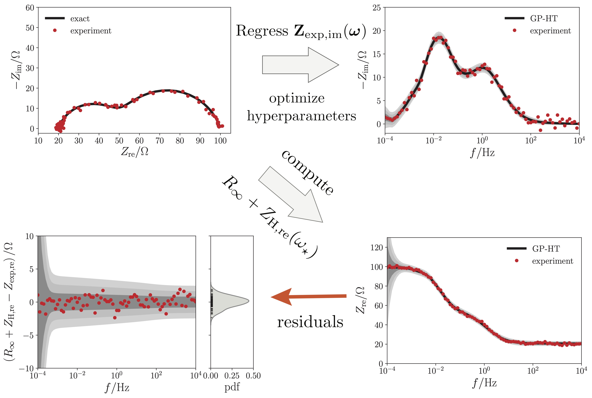

# Gaussian-Process Hilbert Transform (GP-HT)

## Project

This repository contains some of the source code used for the paper entitled "The Gaussian Process Hilbert Transform (GP-HT): Testing the Consistency of Electrochemical Impedance Spectroscopy Data" https://iopscience.iop.org/article/10.1149/1945-7111/aba937. Thepreprint is also available in the docs folder.

## Description
Electrochemical impedance spectroscopy (EIS) is an experimental technique that is frequently used in electrochemistry. While measuring EIS spectra is relatively simple, the interpretation of the data is hindered if the electrochemical system under study is not linear, causal, stable, and time invariant. These requirements can be assessed by applying the Kramers-Kronig relations or Hilbert transform (HT) to the EIS data. Here, we develop a new probabilistic approach to compute the HT of impedance spectra. The method, called the Gaussian process Hilbert transform (GP-HT), leverages Gaussian processes that are constrained to comply with the HT. The GP-HT, which is an infinite-dimensional generalization of previously developed Bayesian HT, is used to predict the credible intervals of the real part of the EIS spectrum from its imaginary component. The quality of the measurements can then be assessed by benchmarking the prediction against the real part of the experimental EIS spectrum. 

<strong>Figure 1. Schematic illustration of the GP-HT method.</strong>

